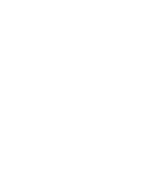

::: {.hero}
::: {.hero-text}
## Disorder as a materials-design tool

I am a tenure-track Assistant Professor at École Polytechnique, where I study disorder in high entropy oxides. My research combines solid-state synthesis, structural characterization and computational modelling to understand how the phase stability, local structure, and properties are affected by the extreme chemical disorder in such materials. 

:::

::: {.hero-card}
### Current interests
- High-entropy and entropy-stabilized oxides
- Short-range order and local distortions
- Phase stability and materials discovery
- Order–disorder transitions
- Collective properties in extreme disorder
:::
:::

<section class="research-approach">
  <h2>Research approach</h2>

  

    

      
      

        <h3>Synthesis</h3>
        
Solid-state and solution-based synthesis of new high entropy oxides.

      

    

    

      
      

        <h3>Structural characterization</h3>
        
X-ray-based techniques for crystallography and local-structure measurements of disordered materials.

      

    

    

      
      

        <h3>Modelling</h3>
        
DFT, cluster expansions and atomistic simulation of disorder and stability.

      

    

  

</section>
