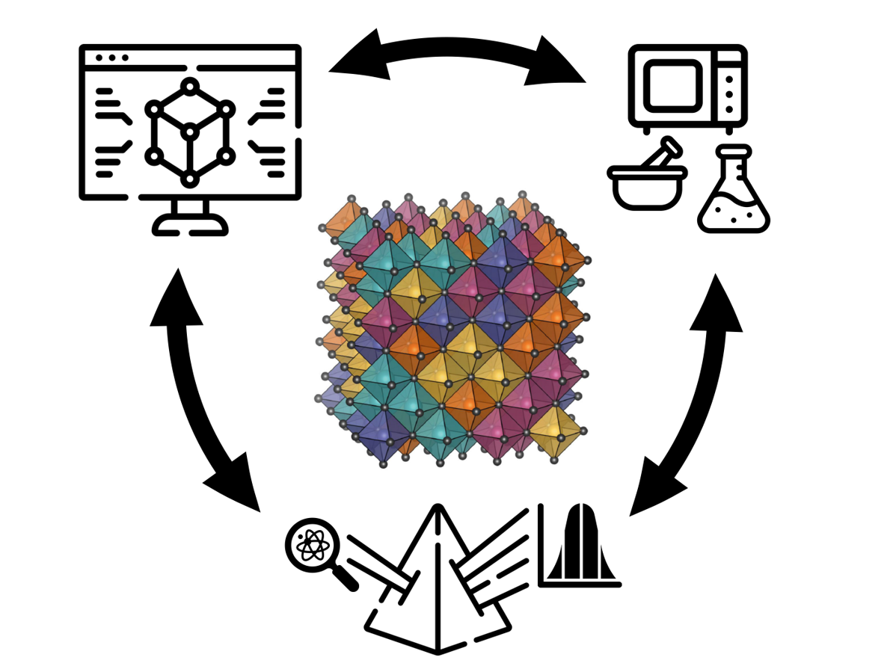

I am currently developing three research directions:
### Discovery of new high-entropy oxides and entropy-stabilized oxides
### Short-range order and local distortions in disordered materials
### Collective properties under extreme chemical disorder

## Methods
We use a wide range of tools necessary to answer complex questions about the structure of disordered materials, including but not limited to
Experimental:
- Solid-state and solution-based synthesis
- Laboratory and synchrotron x-ray techniques
Computational:
- Density-functional theory calculations, with emphasis on energetics and lattice dynamics
- Cluster expansions and configurational sampling
- Machine-learning interatomic potentials

{.methods-picture}
